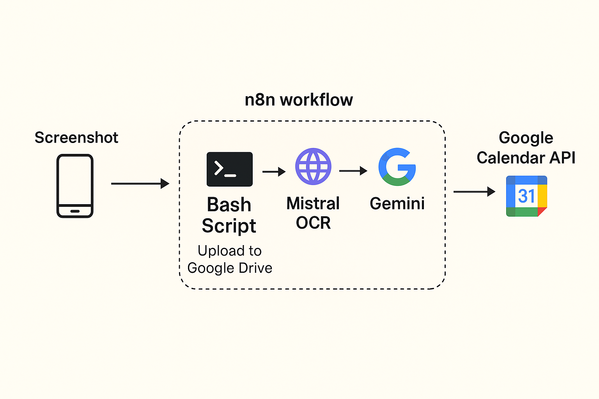
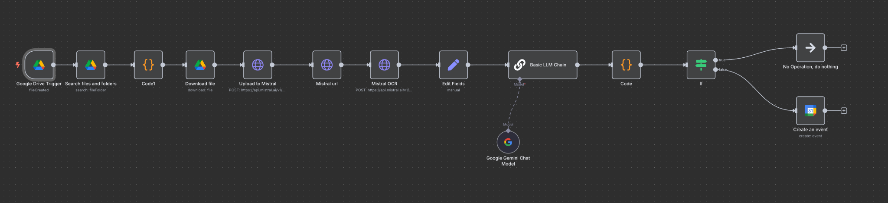

 <!--  ┏━━━━━━━━━━━━━━━━━━━━━━━━━━━━━━━━━━━━━━━━━━┓  -->
<!--  ┃  S C R E E N S H O T   ➜   C A L E N D A R ┃  -->
<!--  ┗━━━━━━━━━━━━━━━━━━━━━━━━━━━━━━━━━━━━━━━━━━┛  -->

<h1 align="center">📸 Screenshot → Calendar Workflow 🗓️</h1>


<div align="center">
📸 Take a screenshot → 📂 auto‑sync to Drive → 🦅 Mistral OCR → ✨ Gemini LLM → 🗓️ Google Calendar → 🔔 Slack ping  
<sub><sup>Zero clicks. Zero forgotten tasks.</sup></sub>


</div>

---

## ✨ What is this?

A bite‑sized automation that **reads every screenshot you take** and—if it contains something actionable—**drops a polished Calendar event** (and Slack reminder) so you’ll never lose track of important emails, deadlines, or invites again.

| Step | Tech | Description |
|------|------|-------------|
| 0️⃣  | **Bash + AppleScript** | Detect new screenshots and instantly upload them to a “TODO” folder in Google Drive. |
| 1️⃣  | **Google Drive Trigger** | n8n wakes up on every new file in that folder. |
| 2️⃣  | **Mistral OCR** | Extracts clean, Markdown‑formatted text on‑device 🦅 |
| 3️⃣  | **Gemini LLM** | Classifies importance & builds a JSON payload (title, time, notes). |
| 4️⃣  | **n8n Router** | Calendar event if *important* ✅ / No‑op if *ignore* 🚫 |
| 5️⃣  | **Google Calendar API** | Creates a 15‑min block + attaches the original screenshot. |
| 6️⃣  | **Slack Webhook** (optional) | Sends you a heads‑up DM. |

<p align="center">
  
</p>

<p align="center">
  
</p>
---

## 🚀 Quick start

```bash
# 1. Clone & spin up n8n via Docker Compose
git clone https://github.com/yourname/screenshot-to-calendar.git
cd screenshot-to-calendar
docker compose up -d

# 2. Import the workflow
n8n import:workflow --input workflows/screenshot-to-calendar.json

# 3. Set your secrets
#    GOOGLE_DRIVE_CREDENTIALS, GOOGLE_CALENDAR_CREDENTIALS, MISTRAL_API_KEY
cp .env.example .env && nano .env
docker compose restart n8n
